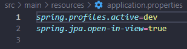
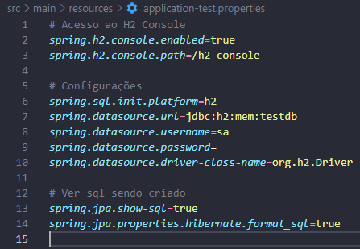
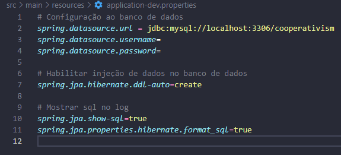
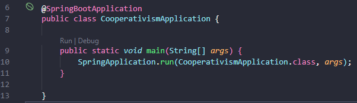

# Cooperativa Api

## Descrição do Projeto

Projeto consiste na criação de uma api para uma cooperativa, onde teremos cadastros de pautas, abertura e fechamento de sessões de votação e sumarização de votação.

Este projeto foi feita na participação da avaliação técnica da empresa [act digital](https://actdigital.com/).

## End-Points do Projeto

### Para Pautas

- [GET] consultar 1 pauta especifico, passar id por parametro na requisição: {url}/schedule/{id}

- [POST] criar pauta: {url}/book/create
``` Json Body
{
    "content": "type string",
}
```

### Para Associados

- [GET] consultar 1 associado especifico, passar id por parametro na requisição: {url}/associate/{id}

- [POST] criar Associado: {url}/associate/create
``` Json Body
{
    "name": "type string",
    "email": "type string",
    "cpf": "type string"
}
```

- [Put] {url}/associate/vote
``` Json Body
{
    // Id da sessão
    "sessionId": "type number",
    // Id do associado
    "associateId": "type number",
    // Sim ou Não
    "vote": "type string"
}
```

- [Get] Integração com sistemas externos: {url}/associate?cpf=

### Para Sessão

- [GET] consultar 1 sessão especifica, passar id por parametro na requisição: {url}/session/{id}

- [POST] Abrir e fechar sessão: {url}/session/{id}
``` Json Body
{
    // Pode ser nulo
    "minutes": "type number",
    // Id da pauta
    "scheduleId": "type number"
}
```
- [GET] Contagem de votos: {url}/count-votes/{sessionId}


## Descrição da Api
- Observação: Não foi feito deploy do projeto como proposto, pois as ferramentas que encontrei são pagas.
### Executar Api localmente:
- Para clonar o projeto: git clone https://github.com/TaylanTorres09/cooperativism-api.git
- Para Executar o projeto precisasse:
    - Java [JDK](https://www.oracle.com/java/technologies/downloads/#java17). Este projeto está usando a versão 17.
    - Para perfil de Teste, Banco [H2](https://www.h2database.com/html/main.html) utilizado em memória, coloquei neste pois é um banco de fácil configuração e utilização.
    - Para perfil de Dev, Banco [MySQL](https://www.mysql.com/products/workbench/).

- Extensões do vscode utilizadas:
    - [Debugger for Java](https://marketplace.visualstudio.com/items?itemName=redhat.java)
    - [Spring Boot Extension Pack](https://marketplace.visualstudio.com/items?itemName=Pivotal.vscode-boot-dev-pack)

- Para seleção do perfil **test** para perfil de teste e **dev** para perfil de desenvolvimento.




- Configuração do banco de dados de Teste.



- Configuração do banco de dados de Dev.



- Na pasta src/main, execute o arquivo CooperativismApplication.java




- Para testar a api você pode utilizar ferramentas de client como:
    - [Postman](https://www.postman.com/)
    - [Insomnia](https://insomnia.rest/download)
    - Extensão do VsCode [Thunder Client](https://marketplace.visualstudio.com/items?itemName=rangav.vscode-thunder-client)
    - Ou outra de sua preferência.

## Próximos Passos
- Fazer interfaces no front-end.
- Implementar Cobertura de testes.
## Autor
<a href="https://www.linkedin.com/in/taylan-torres" target="_blank"></a> 